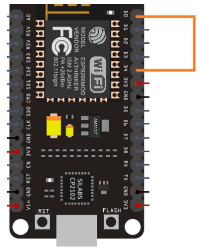

# NodeMCU_WiFi_Logger
A simple WiFi network logger for ESP8266/NodeMCU boards created with Arduino IDE.

# Setting it up for wardrive/logging
- Install [Arduino IDE](https://www.arduino.cc/en/software) in your system
- Now, install driver for NodeMCU board, like for [64-bit](https://github.com/himanshus2847/NodeMCU-setup/blob/master/Drivers/CP210x_Universal_Windows_Driver/CP210xVCPInstaller_x64.exe), [32-bit](https://github.com/himanshus2847/NodeMCU-setup/blob/master/Drivers/CP210x_Universal_Windows_Driver/CP210xVCPInstaller_x86.exe) in windows.
- Copy and paste the code from the [sketch file](https://raw.githubusercontent.com/shriyanss/ESP8266_WiFi_Logger/main/WiFi_Logger/WiFi_Logger.ino). Remember to change wifi credentials
- Set Arduino IDE for your board. Tutorial [here](https://create.arduino.cc/projecthub/Metavix/programming-the-esp8266-with-the-arduino-ide-601c16)
- Now connect your board to your PC/laptop and hit upload button (arrow-like button on top left in IDE)
- Now just remove it from laptop and connect it to portable power source, like power bank for mobile phones
- Get into your vehicle and drive it to collect wifi info

# Getting the data
Just connect pin D0 to D4, an led will glow. Then get another device and connect it to WiFi (with credentials you defined). Head over to http://192.168.4.1 and see the results

# Some tips/warnings
- **The WiFi list is stored in RAM. So make sure you get WiFi without switching the board off.**
- Gather WiFi info in afternoon. You could get more networks as it is working time.
